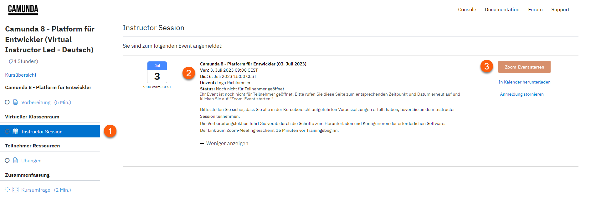
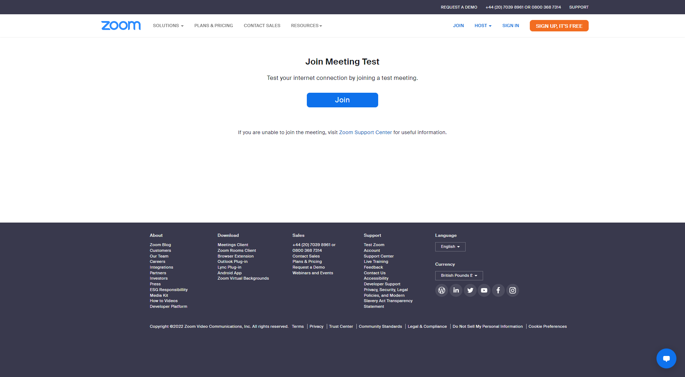
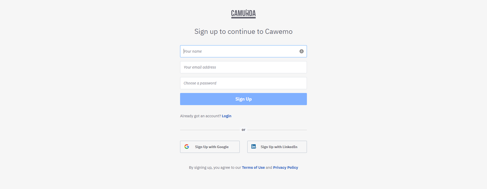
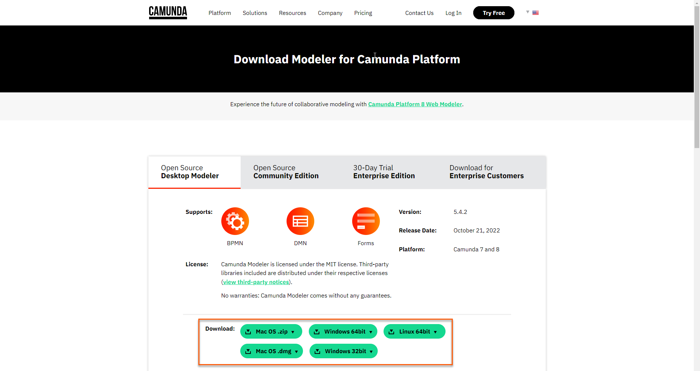

Bitte stellen Sie sicher, dass Sie die folgenden Vorbereitungen abgeschlossen haben, bevor Sie versuchen, dem virtuellen Klassenraum beizutreten.

* Sehen Sie sich die Beitrittsanweisungen an
* Erstellen Sie ein Konto bei [Cawemo](https://cawemo.com/#c7-cawemo-signup)
* Downloaden und installieren Sie [Camunda Modeler](https://camunda.com/download/modeler)

### Sehen Sie sich die Beitrittsanweisungen an

Sehen Sie sich die Beitrittsanweisungen für Ihren Kurs an, indem Sie die folgenden Schritte ausführen:

1. Navigieren Sie über das Kursmenü auf der linken Seite zu **Virtueller Klassenraum -> Instructor Session**.
   
    

1. Stellen Sie sicher, dass die **Startzeit** und **Endzeit** des Kurses wie erwartet sind.
   
2. Überprüfen Sie die virtuelle Meeting-Plattform, die für die Durchführung des Kurses verwendet wird.
   
   !!! note "Virtuelle Meeting-Plattform"
       Ihr Trainer wird [Zoom](https://zoom.us/) verwenden, es sei denn Ihr Unternehmen hat die Nutzung einer alternativen virtuellen Meeting-Plattform angefordert, z.B. [Microsoft Teams](https://www.microsoft.com/en-gb/microsoft-teams).
       
       Wenn Ihre Einladung keinen Zoom-Link enthält, kann der Zoom-Verbindungstest übersprungen werden. 

#### Zoom-Verbindungstest

Führen Sie einen Zoom-Verbindungstest durch, indem Sie die folgenden Schritte ausführen:

1. Navigieren Sie zu [Zoom-Verbindungstest](https://zoom.us/test)

    

1. Klicken Sie auf **Beitreten**, um ein Testmeeting zu starten

1. Bestätigen Sie, dass Ihre Webcam wie erwartet funktioniert

1. Bestätigen Sie, dass Ihre Lautsprecher wie erwartet funktionieren

1. Bestätigen Sie, dass Ihr Mikrofon wie erwartet funktioniert

1. Klicken Sie auf **Test beenden**, wenn alle Ihre Geräte wie erwartet funktionieren

### Cawemo

Erstellen Sie ein Cawemo-Konto, indem Sie die folgenden Schritte ausführen:

1. Navigieren Sie zu [Cawemo](https://cawemo.com/#c7-cawemo-signup) und klicken Sie auf **Kostenlos für Cawemo registrieren**

1. Geben Sie Ihren Namen, Ihre E-Mail-Adresse und Ihr Passwort ein, um ein Konto zu erstellen

    

1. Stellen Sie sicher, dass Ihr Konto erfolgreich erstellt wurde, indem Sie versuchen, sich [anzumelden](https://cawemo.com/login)

1. Ihnen wird außerdem ein Bestätigungslink via E-Mail zugesandt. Um die Registrierung abzuschließen müssen Sie diesen Link anklicken, ansonsten verlieren Sie nach 24 Stunden den Zugriff auf Ihren Account

### Camunda Modeler

Laden Sie den [Camunda Modeler](https://camunda.com/download/modeler) herunter und installieren Sie ihn, indem Sie die folgenden Schritte ausführen:

1. Navigieren Sie zu [Camunda Modeler](https://camunda.com/download/modeler)

1. Laden Sie die richtige Version für Ihren Computer herunter und entpacken Sie die Datei in einen Ordner Ihrer Wahl

    

1. Führen Sie Camunda Modeler.exe (Windows), Camunda Modeler.app (Mac) oder camunda-modeler (Linux) aus, um den Modeler zu starten

!!! success "Vorbereitung abgeschlossen"
    Herzlichen Glückwunsch! Sie sind jetzt bereit, dem virtuellen Klassenraum beizutreten.
