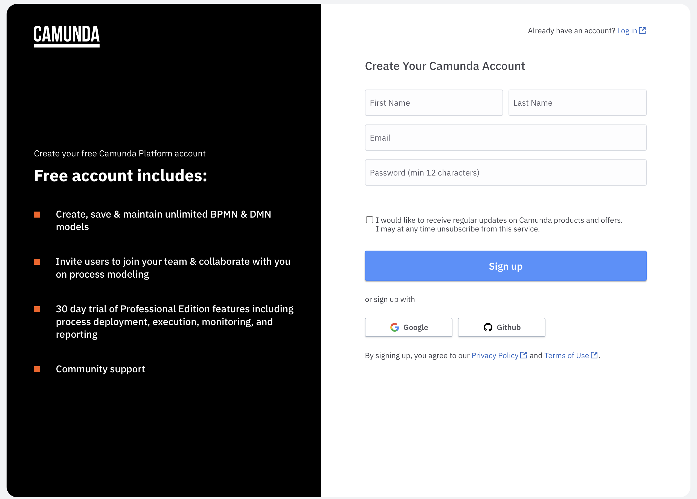

Bitte stellen Sie sicher, dass Sie die folgenden Vorbereitungen abgeschlossen haben, bevor Sie versuchen, dem virtuellen Klassenraum beizutreten.

* Sehen Sie sich die Beitrittsanweisungen an
* Führen Sie einen Zoom-Verbindungstest durch
* Erstellen Sie ein Konto bei [Camunda Platform (SaaS)](https://signup.camunda.com/accounts)

### Sehen Sie sich die Beitrittsanweisungen an

Sehen Sie sich die Beitrittsanweisungen für Ihren Kurs an, indem Sie die folgenden Schritte ausführen:

1. Navigieren Sie über das Kursmenü auf der linken Seite zu **Virtueller Klassenraum -> Instructor Session**.

    

1. Stellen Sie sicher, dass die **Startzeit** und **Endzeit** des Kurses wie erwartet sind.

2. Überprüfen Sie die virtuelle Meeting-Plattform, die für die Durchführung des Kurses verwendet wird.

   !!! note "Virtuelle Meeting-Plattform"
       Ihr Trainer wird [Zoom](https://zoom.us/) verwenden, es sei denn Ihr Unternehmen hat die Nutzung einer alternativen virtuellen Meeting-Plattform angefordert, z.B. [Microsoft Teams](https://www.microsoft.com/en-gb/microsoft-teams).

       Wenn Ihre Einladung keinen Zoom-Link enthält, kann der Zoom-Verbindungstest übersprungen werden.

#### Zoom-Verbindungstest

Führen Sie einen Zoom-Verbindungstest durch, indem Sie die folgenden Schritte ausführen:

1. Navigieren Sie zu [Zoom-Verbindungstest](https://zoom.us/test)

    

1. Klicken Sie auf **Beitreten**, um ein Testmeeting zu starten

1. Bestätigen Sie, dass Ihre Webcam wie erwartet funktioniert

1. Bestätigen Sie, dass Ihre Lautsprecher wie erwartet funktionieren

1. Bestätigen Sie, dass Ihr Mikrofon wie erwartet funktioniert

1. Klicken Sie auf **Test beenden**, wenn alle Ihre Geräte wie erwartet funktionieren

### Camunda 8 SaaS

Erstellen Sie ein Camunda Platform SaaS Konto, indem Sie die folgenden Schritte ausführen:

1. Navigieren Sie zu [Camunda Platform SaaS](https://signup.camunda.com/accounts)

    

2. Sie können entweder das Formular ausfüllen und sich registrieren oder Ihr bestehendes Google oder Github Konto verwenden um sich anzumelden.

3. Wenn Sie das Formular ausfüllen um ein Konto zu erstellen, erhalten Sie eine Bestätigungsmail. Klicken Sie in dieser auf den inkludierten Link um Ihre E-Mail Adresse zu bestätigen und ein Passwort festzulegen.

4. Wenn Sie einen bestehenden Google oder Github Account verwendet haben, werden Sie automatisch zur [Camunda 8 Console](https://console.cloud.camunda.io/) weitergeleitet

!!! success "Vorbereitung abgeschlossen"
    Herzlichen Glückwunsch! Sie sind jetzt bereit, dem virtuellen Klassenraum beizutreten.
