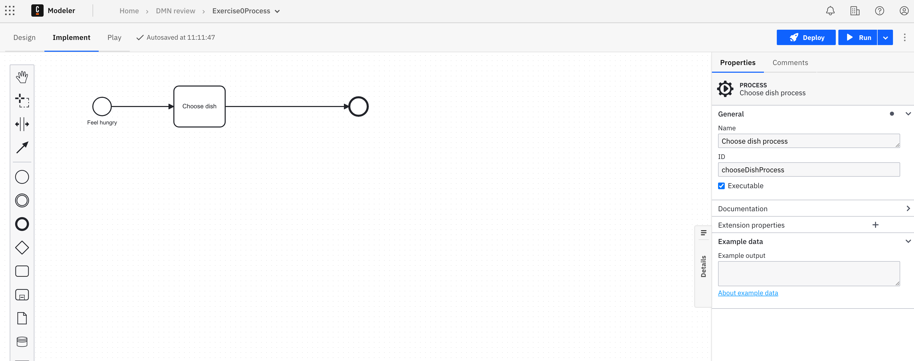
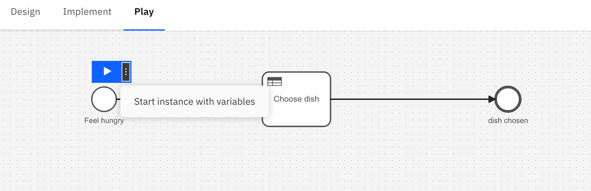

## Demo: Execute your diagram

### Background

Once your DMN diagram is created, you may want to test it.
In this demo we are going to test a DMN decision table by using a BPMN process and Zeebe Play.

### Instructions

In order to test a DMN decision table, we need a BPMN process.
Let's create it!

1. From your project folder click on the `New file` button to create a `BPMN Diagram`.

2. Draw the following model:

   

3. Give it a name and an ID as in the image above.

4. Select the task and click on the **Wrench** icon. From there select the Business Rule task.

   

   The task symbol will change accordingly:

   

5. On the Property panel (right side of the screen) configure the Implementation:

   - In the Drop down select **Dmn Decision** as implementation.

   - In the Called Decision section give the **Decision ID** you've defined in the previous exercise.

   - Define also a name for the **result variable**.

   The configuration should be similar to this one:

   

6. Now we can test our decision by simulating the start of a new process instance with the Play tool.
7. Click on the "Play" tab and wait for the window to popup.


8. A white window should popup with the Business Process on it. This is a Test environment called Zeebe Play.
   We will use it to test our Decision table.
9. Click on the **chooseDishProcess** link.


10. Click on the small arrow to select the "with variables" options. We want to start a process instance by passing th variables required by the DMN table.



11. in the text box provide values that match the inputs of your Decision table. For instance:

```
{"season":"spring","vegetarian":false}
```

The process will be executed, and you should get a similar status to the following:


12. Click on the **Decision Evaluations** tab and then on the **Decision Evaluation key** as shown in the picture.


13. The Business Rule executed will be shown in a new window.


