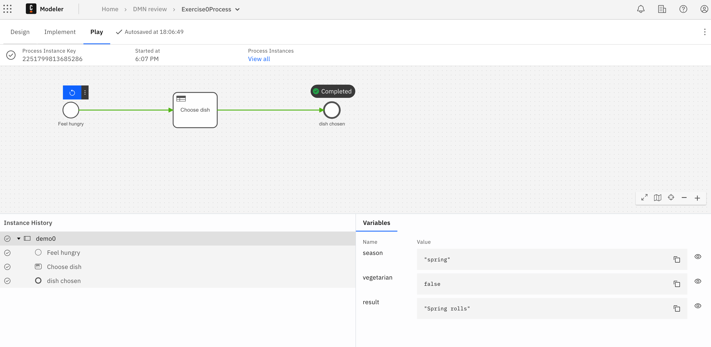

## Demo: Execute your diagram

### Background

Once your DMN diagram is created, you may want to test it.
In this demo we are going to test a DMN decision table by using a BPMN process and Zeebe Play.

### Instructions

1. Download the `Exercise0Process.bpmn` from the Student Resources (Ask your trainer in case of doubts)
2. Upload the process to your project clicking on "Upload files"


This is a simple Business process.

3. Click on the "Play" button and wait for the window to popup


4. A white window should popup with the Business Process on it. This is a Test environment called Zeebe Play.
   We will use it to test our Decision table.
5. Click on the chooseDishProcess link


6. Click on the small arrow to select the "with variables" options. We want to start a process instance by passing th variables required by the DMN table.


7. in the text box provide values that match the inputs of your Decision table. For instance:
   ```
   {"season":"spring","vegetarian":false}
   ```
   The process will be executed, and you should get the following status:



8. Click on the "Decision Evaluations" tab and then on the "Decision Evaluation key" as shown in the picture


9. The Business Rule executed will be shown in a new window


