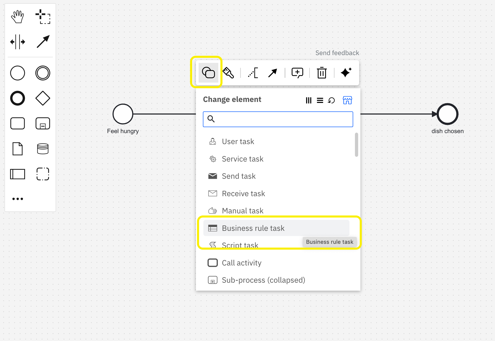

## Demo: Execute your diagram

### Background

Once your DMN diagram is created, you may want to test it.
In this demo we are going to test a DMN decision table by using a BPMN process and Zeebe Play.

### Instructions

In order to test a DMN decision table, we need a BPMN process.
Let's create it!

1. From your project folder click on the `New file` button to create a `BPMN Diagram`.

2. Draw the following model:

   

3. Give it a name and an ID as in the image above.

4. Select the task and click on the symbol with two round shapes on the top left.
5. From there select the Business Rule task.

   

   The task symbol will change accordingly:

   

6. Select the blue link icon that just popped up on top of the task

   - A popup will open with a list of available decisions.

   - Select the one you created in the previous exercise and click on it.

   - Now check the property panel of the task to the right, the Decision ID should have been updated automatically.

   - Define also a name for the **result variable**.

   The configuration should be similar to this one:

   

7. Now we can test our decision by simulating the start of a new process instance with the Play tool.
8. Click on the "Play" tab in order to create the Play environment for testing.


9. A popup will appear showing the progress of the cluster creation. When ready it should show a button: "Start a process instance".
10. Click on it to close the popup.
11. You have just accessed the test environment called Zeebe Play. We will use it to test our Decision table.

12. Click on the small three dots symbol to the right of the arrow to select the "Start instance with variables" options.
13. We want to start a process instance by passing the variables required by the DMN table.


14. A text box will open: insert the values that match the inputs of your Decision table. For instance:

```
{"season":"spring","vegetarian":false}
```

The process will be executed, and you should get a status similar to the following:


15. In the variables list you will see the variable you have defined in the process which is representing the output of the decision table.
16. You can follow this method to test the other rules.
