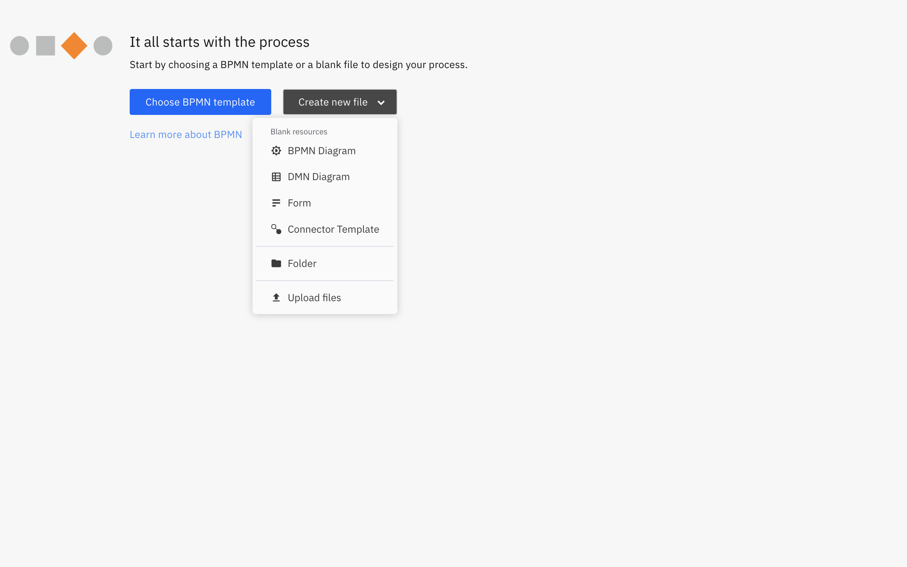

## Lab Zero: Decide upon Dish

### Background

This exercise is to make yourself familiar with the Camunda Modeler.
Draw the DRD and then implement the Decision table as described below.

### Instructions

1. Connect to the [Camunda Web Modeler](https://camunda.io)

2. Create a new folder (if you haven't created one already)

3. Click on the `New file` button to create a `DMN Diagram`
   This is what you will get:

    

4. Draw this Decision Requirement Diagram. To name the elements just double click on them.

1. Select the "Dish" Decision Table and give the following ID: "dishDecision" (property panel to the right)

6. Click on the blue table Icon on the top left corner of the Dish Decision. This will open the DMN Table implementation editor.

   

7. Configure the input (by double clicking on the header) as shown in the example below:

   Season (input expression =”season”, type= “string”)

   

8. Now add another input by clicking on the "+" button to the right of "Season" (Surrounded by a blue square in the picture below).

   

   You can call it "Vegetarian Option" (input expression =”vegetarian”, type =”boolean”).

9. Enter the Output (after the "Then" keyword).

   You can call it “Dish” (Output Name =”dish”, type =”string”).

    

10. Add some rules by inserting text on the cells directly.

    Here you are an example for the first rule.

    

11. Add your own rules.
12. Ensure Hit Policy is “U” (“Unique”).

### Test it

I know you're looking forward to test your decision, in the next Demo we'll see how to do it.

### Bonus

You can predefine the values for the Season on the input column. This simplifies adding new rules, avoids typos and creates an input dictionary.

For doing that, just click on the "Season" column and add the predefined values on the text box at the bottom.
