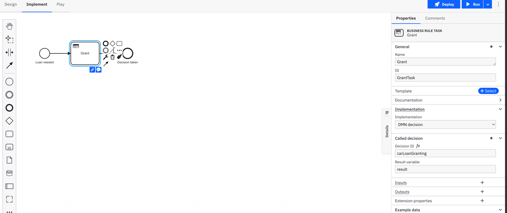

## Lab One: Car Loan Granting

### Background

As a bank we want to automate the granting process for car loans. In the first phase of this automation process we want to decide if a loan should be `Granted` or `Rejected`.

To decide on this, two inputs are needed:

The first input being Affordability which can be `Affordable`, `Unaffordable` or `Marginal`.  
The second one being a credit score provided by a Scoring Agency.
In summary, depending on the level of affordability and the given credit score we accept or reject a loan application.

### Instructions

1. Create a DRD with a Decision "Car Loan Granting" and id "carLoanGranting" (important to keep the same id for the execution later on)
2. The decision takes two inputs:
   - Credit Score (`creditScore`)
   - Affordability (`affordability`)
3. Implement the decision table with these rules:
   - If the Credit Score is lower than `80` or the Affordability is `Unaffordable` we reject the application
   - If the Credit Score is greater than or equal to 95.0 and the Affordability is whether `Affordable` or `Marginal` we grant the loan
   - If the Credit Score is between 80 and 94.9 `[80..94.9]` and the Affordability is `Affordable` we grant the loan
   - If the Credit Score is between 80 and 94.9 `[80..94.9]` and the Affordability is `Marginal` we reject the loan
   - You can use a comma separated list to test against several values (e.g. `Affordable, Marginal`)
4. Use a Hit Policy that fits your DMN table rules [`First`, `Unique`,`Any`]

### Create a BPMN process for testing

5. create a process to test your diagram, and configure the business task.

We'll call it `Exercise1-2-3Process` and we'll reuse it also in the next exercises.

Don't forget to give a proper name and ID to the process.

### Test it

Use Play to test the Process, and consequently the DMN decision table.

Repeat the steps explained in the Demo in order to start a new process instance with Play

- For a Credit Score of 94.9 and Affordability “Affordable” the loan will be granted
- For a Credit Score of 80 and Affordability “Marginal” the loan will be rejected
- For all applications with a Credit Score < 80 the loan will be rejected
- For a Credit Score >= 95.0 and “Marginal” the loan will be accepted

abcdefgljklhffffjflfgflfkgjffkxz9623