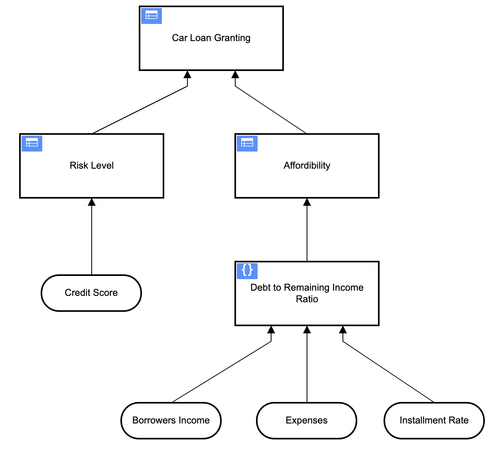

## Lab Three: Implement Affordability Decision

### Background

As the calculation of the Affordability as Input is a Business Rule itself we want to move that part from our BPMN process to the DRD as well.

### Instructions

- Enhance the model from the previous two labs by changing the Input Data "Affordability" to a Decision.
- The affordability in turn depends on a Decision where the ratio of debt to the borrowers remaining income (`debt2RemainingIncomeRatio`) is being calculated.
- The resulting DRD should look like this:

That ratio can be calculated as:

    installmentRate / (borrowersIncome - expenses) * 100

The values for `installmentRate`, `borrowersIncome` and `expenses` will be provided as Input( number).

Rules:

- For a Debt2IncomeRatio less than 50 (`<50`) the Affordability is `affordable`
- For a Debt2IncomeRatio between 50 and 74.9 (`[50..75[`) the Affordability is `marginal`
- For a Debt2IncomeRatio greater than 75(`>=75`) the Affordability is `unaffordable`

Hint:

- Model first the DRD with the Decisions `Affordability`, `Debt to Remaining Income Ratio` and `Remaining Income`
- Add the needed Input Data.
- Connect them as needed.
- Then implement the logic as shown above.

### Test it

Test like in the previously exercises using the `Exercise1-2-3Process.bpmn` process.

For example:

- `borrowersIncome`: 1200.00
- `expenses`: 800.00
- `installmentRate`: 100 ==> `affordable`
- `installmentRate`: 200 ==> `marginal`
- `installmentRate`: 300 ==> `unaffordable`

And here you are the format to pass when testing:

- `{"creditScore":82,"borrowersIncome":1200,"expenses":800,"installmentRate":100}`
- `{"creditScore":82,"borrowersIncome":1200,"expenses":800,"installmentRate":200}`
- `{"creditScore":82,"borrowersIncome":1200,"expenses":800,"installmentRate":300}`

ab