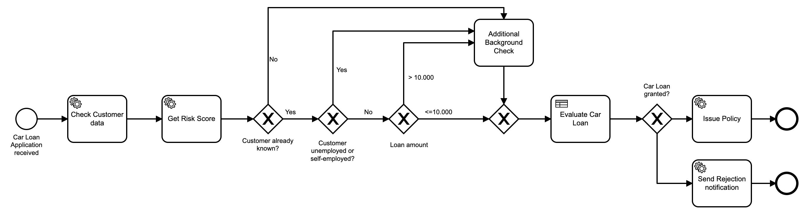
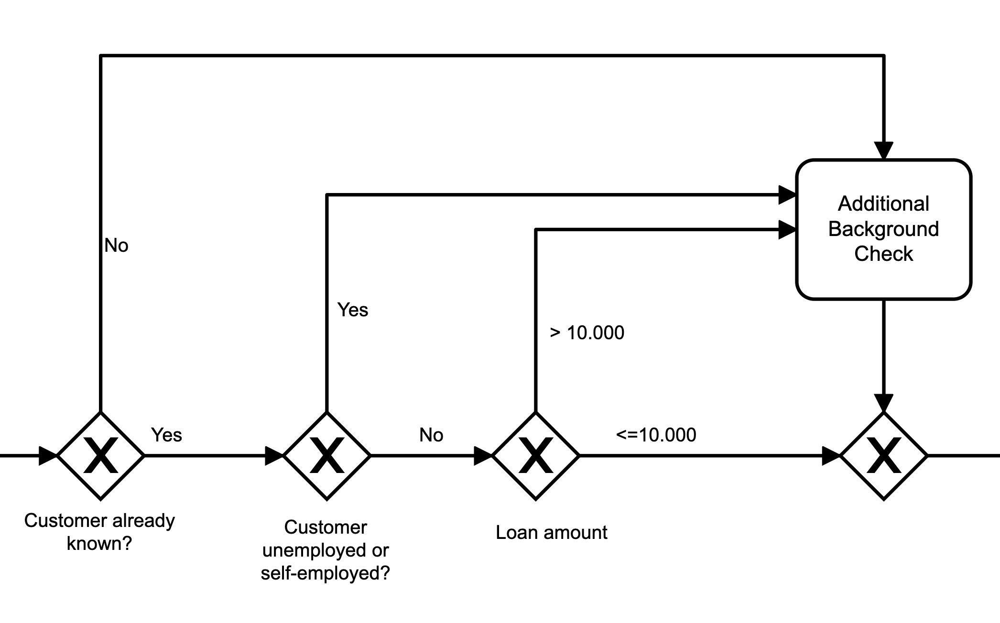
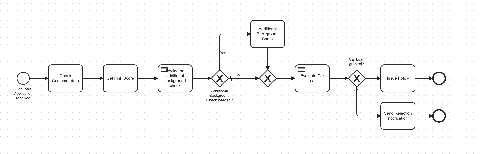

## Lab Four: Extract BPMN logic into DMN

### Goal

Over time the Business Process has changed and several rules have been introduced. This makes it harder to read and understand the process, therefore we want to extract those decisions into DMN. Additionally, business rules shouldn’t be part of the business process.

### Instructions

1. Review the following source model

2. Identify business rules leading up to Additional Background Check task as per the following image.

3. Create a new DMN table that implement these business rules. Please use the id=`additionalBackgroundCheck`
4. Create a process like you did in the previous exercises to test the DMN table individually.

   An example of input is the following: `{"knownCustomer":true,"loanAmount":1000,"employment":"self-employed"}`

### Bonus

You can execute the whole business process that includes this Decision table and the one created in the previous exercise
through the following process: `CompleteCarLoanProcess.bpmn` (you can upload it from the training resources)

An example of input for testing is the following:

`{"creditScore":82,"borrowersIncome":1200,"expenses":800,"installmentRate":100,"knownCustomer":true,"loanAmount":1000,"employment":"self-employed"}`

abbfdèoffhhtrgfgdfgiopgfgdtrtr786565totI89
