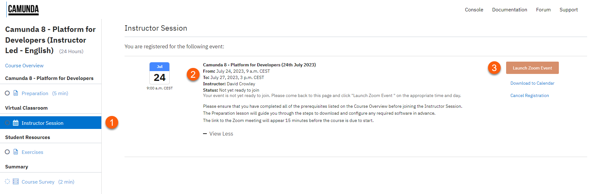
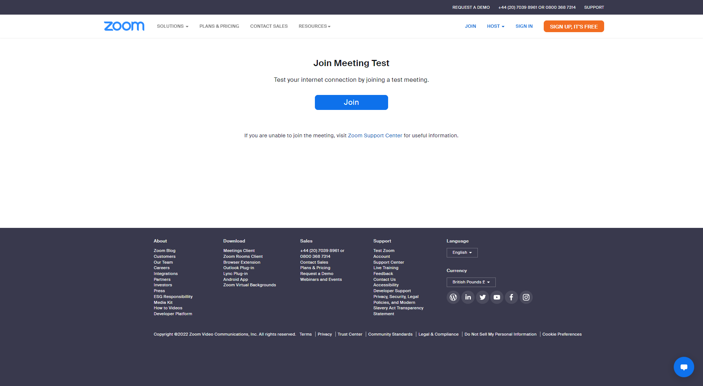
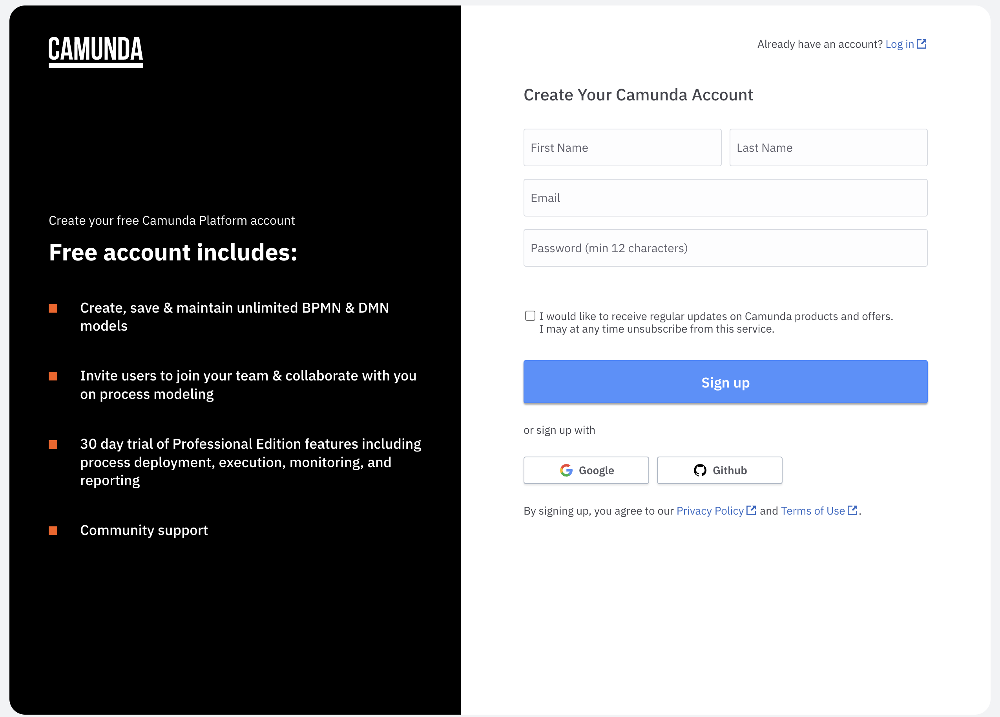

Please ensure that you have completed the following preparation before attempting to join the Virtual Classroom.

* Review Joining Instructions
* Perform a Zoom Connection Test
* Create an account with [Camunda Platform SaaS](https://signup.camunda.com/accounts)

### Review Joining Instructions

Review the joining instructions for your course by following the steps below:

1. Navigate to **Virtual Classroom -> Instructor Session** using the course menu on the left hand side of the screen.

    

2. Confirm the course **Start Time** and **End Time** is as expected.

3. Confirm the virtual meeting platform that will be used to deliver the course.

    !!! note "Virtual Meeting Platform"
        Your Trainer will be using [Zoom](https://zoom.us/) unless your organization has requested an alternative virtual meeting platform e.g. [Microsoft Teams](https://www.microsoft.com/en-gb/microsoft-teams).

        The Zoom Connection Test can be skipped if your invitation does not include a Zoom link.

#### Zoom Connection Test

Perform a Zoom Connection Test by following the steps below:

1. Navigate to [Zoom Connection Test](https://zoom.us/test)

    

2. Click **Join** to start a test meeting

3. Confirm that your webcam is working as expected

4. Confirm that your speakers are working as expected

5. Confirm that your microphone is working as expected

6. Click **End Test** if all of your devices are working as expected

### Camunda 8 SaaS

Follow the steps below to create your Camunda 8 SaaS account:

1. Navigate to [Camunda Platform SaaS](https://signup.camunda.com/accounts)

    

2. You can either complete the form and submit or sign in using your existing Google or GitHub account.

3. If you created an account by filling out the form, you will receive a confirmation email. Click on the included link to verify your email address and set a password.

4. If you created an account by using Google or GitHub, you will be automatically redirected to the [Camunda 8 Console](https://console.cloud.camunda.io/).

!!! success "Preparation Completed"
    Congratulations! You are now ready to join the virtual classroom.
