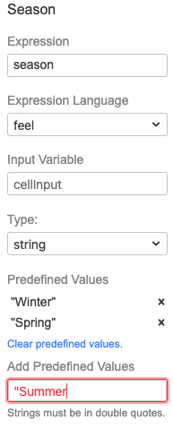

## Lab Zero: Decide upon Dish

### Background
This exercise is to make yourself familiar with the Camunda DMN modeler.
Draw the DRD and the implement the Decision table as described below.

### Instructions
1.	Create a `New` ==> `File` ==> `DMN Diagram`
2.	Draw this DRD

  

3.	Make the Decision a DMN Table (by using the wrench icon)
4.	Click the Icon in the Dish Decision and select Decision Table. This should switch the DMN Table implementation
5.	Add the inputs (by double clicking the header) as shown in the example below:

    a.	Season (input expression =”season”, type= “string”)

    
    
    b.	Vegetarian Option (input expression =”vegetarian”, type =”Boolean”)
6.	Enter the Output “Dish” (Output Expression =”dish”, type =”string”)
7.	Add some rules 
8.	Ensure Hit Policy is “U” (“Unique”)

### Test it
When complete go to the [DMN Simulator](https://consulting.camunda.com/dmn-simulator), drag and drop your model onto the canvas of the webpage. Then test to make sure that every combination of inputs result in exactly one recommended dish.

### Bonus
You can predefine the values for the Season on the input column. This simplifies adding new rules, avoids typos and creates an input dictionary.