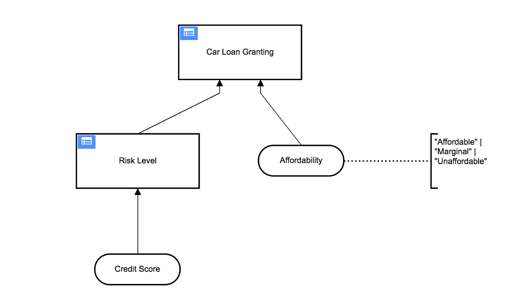

## Lab Two: Categorize Credit Score as Risk Level

### Background
In the future we want to enhance the risk calculation by other factors and we want to make our DRD more robust against changes. Therefore we decide to use  "Risk Level" as input for our Car Loan Granting decision and categorize the Credit Score into pre-defined levels. Thus allowing for decoupling and more easy to manage business rules down the road. 

### Instructions
Take the model you worked on in the previous lab and build upon it by going to the DRD view. Then add a new Decision called "Risk Level" and connect it to the  "Car Loan Granting" Decision.
Change the Top-Level-decision to use a "Risk Level" as Input instead of Credit Score.
Something like this: 

Move the rules accordingly to the Risk Level Decision:

* For a Credit Score less than 80.0 the Risk Level is `"high"`
*	For a Credit Score greater than or equal to 80.0 and less than 95.0 the Risk Level is `"medium"`
*	For a Credit Score greater than or equal to 95.0 the Risk Level is `"low"`

As per the Car Loan Granting Decision Table the Risk Level input options should now be `"low, medium or high"`.  These new input options should replace the old numeric entries based on the  Risk Level Decision range and previous exercise. 

### Test it
When complete go to the [DMN Simulator](https://consulting.camunda.com/dmn-simulator), drag and drop your model onto the canvas of the webpage. 
Execute the same tests as in Lab One.

