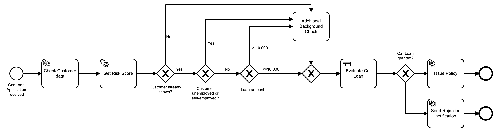

## Lab Four: Extract BPMN logic into DMN

### Goal

Over time the Business Process has changed and several rules have been introduced. This makes it harder to read and understand the process, therefore we want to extract those decisions into DMN.  Additionally, business rules shouldn’t be part of the business process.

### Instructions

1. Review the following source model 

   

2. Identify business rules leading up to Additional Background Check task as per the following image.

   

3. Create a new DMN table that can be referenced by the “Decide on additional background check” Business Rule Task. This will help decide whether an additional background check is needed or not. 

  
  * Take the rules directly from the Source model.

    

