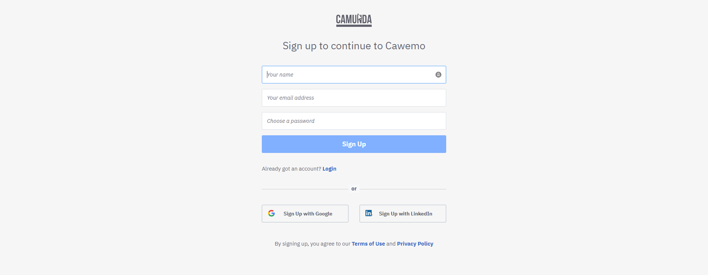

Please ensure that you have completed the following preparation before attempting to join the Virtual Classroom.

* Perform a [Zoom Connection Test](https://zoom.us/test) (Optional)
* Create an account with [Cawemo](https://cawemo.com/#c7-cawemo-signup)
* Download and install [Camunda Modeler](https://camunda.com/download/modeler)

### Zoom Connection Test (Optional)

!!! note "Virtual Meeting Platform"
    Your Trainer will be using [Zoom](https://zoom.us/) unless your organization has requested an alternative virtual meeting platform e.g. [Microsoft Teams](https://www.microsoft.com/en-gb/microsoft-teams).

    This step can be skipped if your invitation does not include a Zoom link.

Perform a Zoom Connection Test by following the steps below:

1. Navigate to [Zoom Connection Test](https://zoom.us/test)

    

1. Click **Join** to start a test meeting

1. Confirm that your webcam is working as expected

1. Confirm that your speakers are working as expected

1. Confirm that your microphone is working as expected

1. Click **End Test** if all of your devices are working as expected

### Cawemo

Create a Cawemo account by following the steps below:

1. Navigate to [Cawemo](https://cawemo.com/#c7-cawemo-signup) and click **Sign up for free for Cawemo**

1. Enter your Name, Email Address and Password to create an account

    

1. Confirm that your account has been created successfully by attempting to [login](https://cawemo.com/login)

1. You will also be sent a confirmation link via email. To complete the registration you must click on this link, otherwise you will lose access to your account after 24 hours

### Camunda Modeler

Download and install the [Camunda Modeler](https://camunda.com/download/modeler) by following the steps below:

1. Navigate to [Camunda Modeler](https://camunda.com/download/modeler)

1. Download the correct version for your machine and unzip in a folder of your choice

    

1. Run Camunda Modeler.exe (Windows), Camunda Modeler.app (Mac) or camunda-modeler (Linux) to launch the Modeler

!!! success "Preparation Completed"
    Congratulations! You are now ready to join the virtual classroom.
